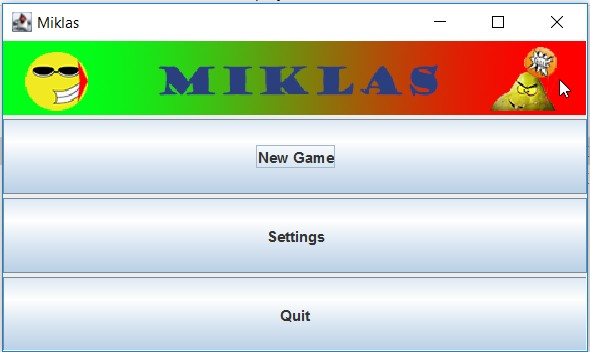
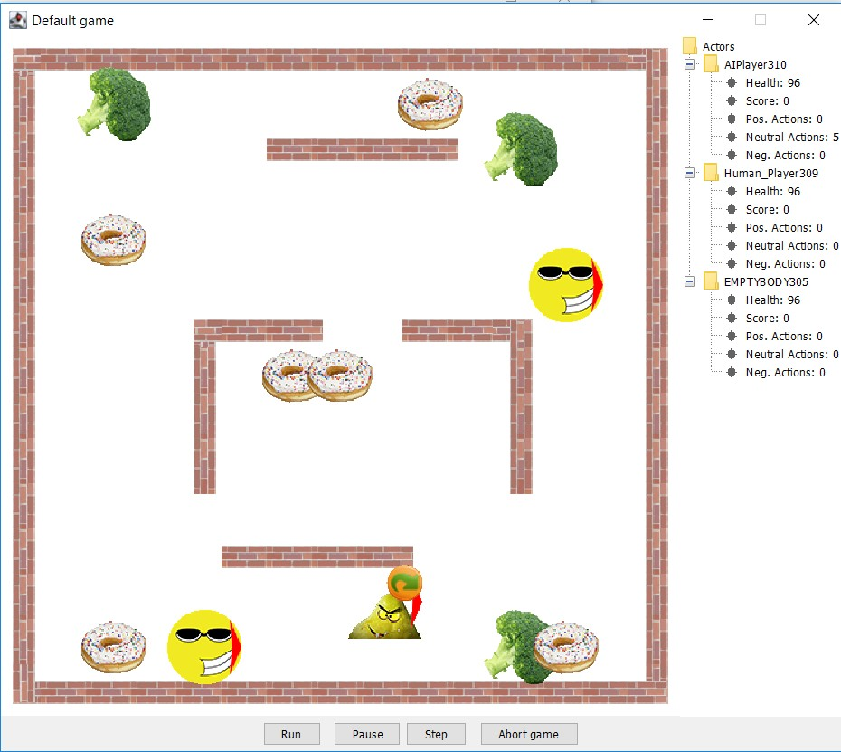
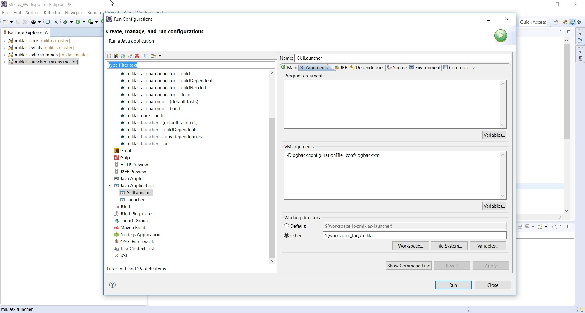
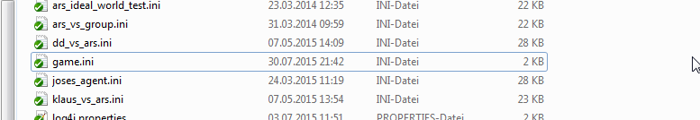
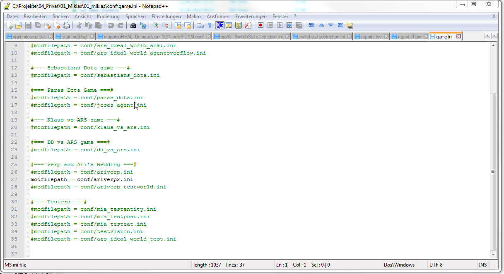
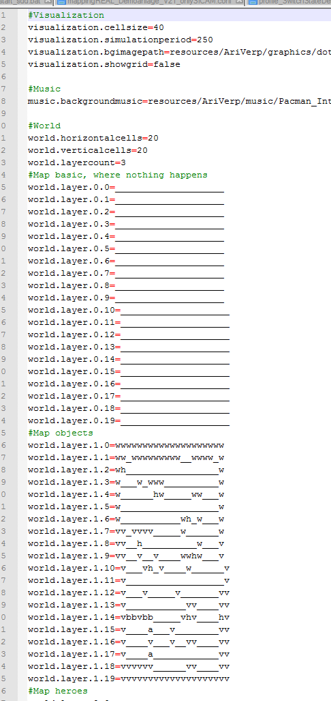
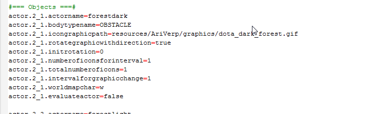
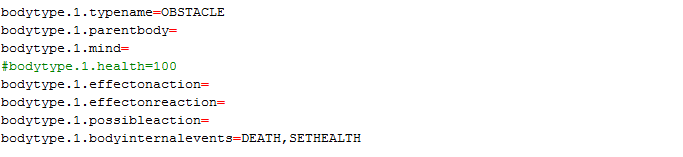
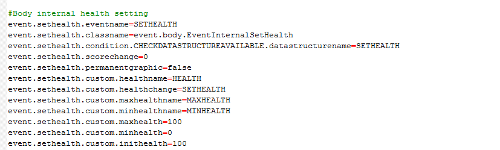
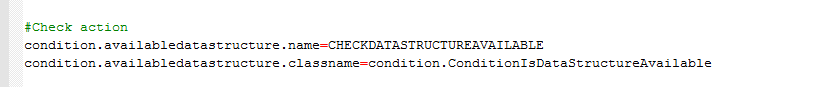

Miklas
====================================================
Miklas is a pacman based game, which is also used as a simulator in the area of artificial intelligence. The game is entirely programmable through a configuration file. The game can be used to create simple simulations, but also to make funny games for birthday parties.

The Game
====================================================
As the game is started with a user inteface, the user can start a game, open the current active configuration file or quit the game.

When the game starts, it looks like the following. It shows the default game

The following commands are available for the human player
- NONE no action
- MOVE_FORWARD: ARROW-UP, move a step formar
- MOVE_BACKWARD: ARROW-DOWN, move a step backwards
- TURN_LEFT: ARROW-LEFT, turn 90° left (45° is also possible if set in the configuration)
- TURN_RIGHT: ARROW-RIGHT, turn 90° right
- EAT: E, eat
- ATTACK: A, bite or attack something
- PUSH: P, push an object
- PULL: O, pull an object with you

Thanks to R. Schneeberger for his contributions to the user interface.

Repository
==================================================== 
The repository consists of the following folders
- /conf: Common logback configuration files; game.ini for the configuration of the active game and the game configuration files
- /deploy: Compiled, running versions
- /doc: Project documentation
- /libs: necessary libraries that cannot be downloaded through Maven
- /log: Place for log files
- /media: Media files for different applications. In the current release, there is a Miklas_default version with free images and music
- /resources: For specific games, specific media files are used in different configurations. They are put here.
- /src: Source files

Installation
====================================================
Miklas requires Java 1.8 or higher. As all libraries of the game are 
1. Download or clone the Miklas project from github
2. In order to build the game, you need to download the following files manually as they are not available through MAVEN
JGameGrid.jar   http://www.aplu.ch/home/download/JGameGrid.zip

mp3plugin.jar   http://www.oracle.com/technetwork/java/javase/download-137625.html

and put them in the /libs folder

Setup in Eclipse
====================================================
In eclipse, for the Launcher, set the Working directory to “${workspace_loc}/miklas, in order to include the config files at the start of the application, use the speicific workspace setting. In the VM arguments, add a line for using Logback.

Game Configuration
====================================================
In the config file game.ini, a link to the real game config files exist.

In the example, the path is set to “conf/ariverp2.ini”

The world is created with layers. “_” means nothing. All other letters are assigned to certain “actors” in the world. For instance, the letter “w” in the map is here a piece of forest.

Each actor has a bodytypename. The bodytype defines the body of the actor.

In the case above, only internal events are associated with the body. An example is the “SETHEALTH”. The event is invoked from a class in the “classname”. If an event is activated it performs some action on the body.

Only if a condition is satisfied, the event will execute. Conditions are defined as own invoked classes.

Miklas Documentation
====================================================
Several student project used the Miklas framework to test concepts of artificial intelligence. Some of the works can be found within this project. In doc/03_Students this documentation can be found
1. R. Schneeberger: Erstellung und Evaluierung einer auf neuronalen Netzen basierenden, kognitiven Architektur, Master thesis, TU Wien, 2018
2. A. Czikos: Creating a Reference Agent for the SiMA Agent a Bench-mark, Seminar work, TU Wien, 2016.
